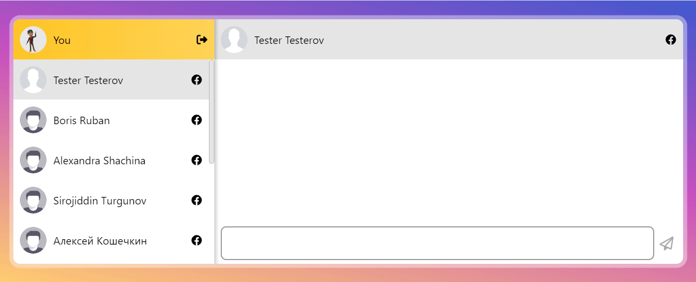
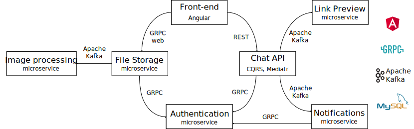

# 💬LetsTalk Chat App💬 @ front-end

🔔 Please, also see the [back-end repository](https://github.com/evgenii-petukhov/LetsTalk.Server) 🙏

🔴 [Live demo](https://chat.epetukhov.cyou/)
## Description
This is an instant messaging service with authentication via social media, such as Facebook. The service allows users to send text messages and share links. 

This project is a showcase of my technical skills and talent for potential IT recruiters, employers, customers, etc. It demonstrates that I am able to
* create a single-page web application with Angular
* implement reactive state management with NgRx store in Angular applications
* understand the basic principles of the OpenAPI Specification
* understand microservice communication patterns and protocols, such as GRPC
* understand the main principles of microservice architecture, event-driven development, and experienced in using Apache Kafka
## Architecture

The back-end implements microservice architecture. There are a few microservices, such as

| Microservice name | Protocol | Description |
| ----------- | ----------- | ----------- |
| Chat API | REST | Responsible for sending messages and account management |
| Authentication | GRPC | Generates and validates JSON Web Tokens |
| Notification | Apache Kafka, SignalR | Sends out notifications about new messages |
| Link preview | Apache Kafka | Decorates messages with a website's name and a picture preview, if a message contains links |
| File storage | GRPC Web | Saves a user's avatar on the file system, serves avatars by request |
## Get started
1. Clone the repository
2. Install dependencies `npm install`
3. Build the project. Use one of the following commands
   - `npm run build` for the production environment
   - `npm run build:dev` for development purposes
4. Copy the output files to the website's directory